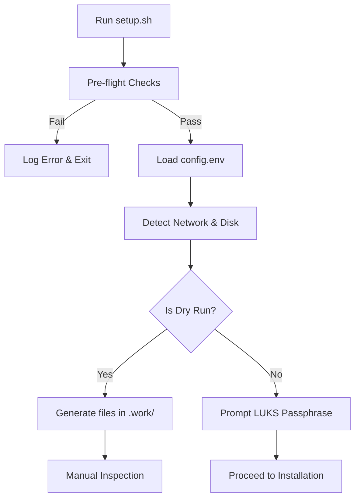
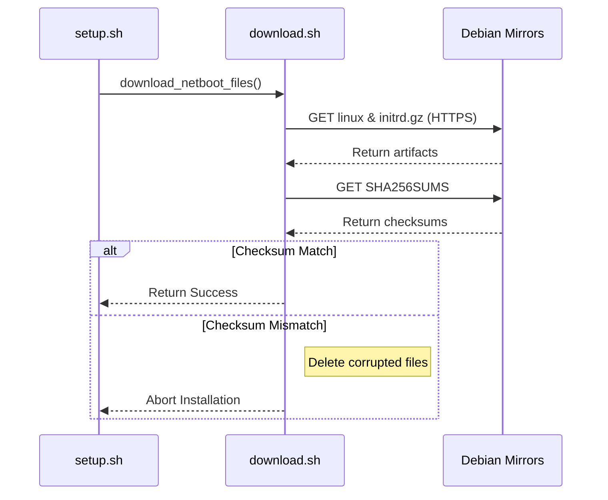

Relevant source files

The following files were used as context for generating this wiki page:

- [setup.sh](setup.sh)
- [README.md](README.md)
- [lib/download.sh](lib/download.sh)
- [lib/detect_network.sh](lib/detect_network.sh)
- [lib/detect_disk.sh](lib/detect_disk.sh)
- [lib/kexec_boot.sh](lib/kexec_boot.sh)
- [lib/generate_postinst.sh](lib/generate_postinst.sh)

# Troubleshooting & Logs

## Introduction

Troubleshooting and logging within the `vps-setup` project encompass the diagnostic procedures and data trails generated during the automated Debian reinstallation process. The system provides multiple layers of verification—from pre-flight checks and dry-run simulations to post-installation reports—to ensure a secure and successful deployment. Because the script utilizes `kexec` to replace the running environment, understanding the transition between the host OS, the installer RAMdisk, and the final encrypted system is critical for resolving issues.

The scope of troubleshooting covers network auto-detection, disk partitioning verification, SHA256 artifact validation, and LUKS key rotation. Detailed logs and summary files are generated at various stages to provide a technical baseline for the administrator.

## Pre-Installation Diagnostics

Before any changes are made to the system, the script performs extensive checks to identify potential environment incompatibilities.

### Pre-flight Checks
The system validates the execution environment to prevent failures during the `kexec` transition. It checks for root privileges, Linux OS compatibility, and hardware architecture. Crucially, it detects the virtualization type; since `kexec` requires full virtualization, the script will abort on container-based environments like LXC or OpenVZ.
Sources: [setup.sh:84-118](setup.sh#L84-L118)

### Dry Run Mode
Users can invoke `--dry-run` or `-n` to generate all configuration files (preseed and post-install) in the `.work/` directory without performing any destructive actions. This allows for manual inspection of the logic before deployment.
Sources: [setup.sh:310-316](setup.sh#L310-L316), [README.md:104-110](README.md#L104-L110)

The diagram shows the validation path that allows users to troubleshoot configuration logic via Dry Run mode before committing to the installation.
Sources: [setup.sh:350-424](setup.sh#L350-L424)

## Execution Logs and Reports

Once the installation proceeds, the system generates several key files to document the process and state of the system.

### Generated Reports
Following a successful installation, the following files are created in the root directory for post-deployment verification:

| File Path | Description |
|-----------|-------------|
| `/root/vps-install-summary.txt` | General summary of the installation parameters and roles. |
| `/root/encryption-report.txt` | Full disk encryption status and LUKS configuration details. |
| `/root/luks-header-backup.img` | An unencrypted backup of the LUKS header (mode 600). |
| `/var/log/vps-postinst.log` | Detailed log of the post-installation hardening script execution. |
Sources: [README.md:195-205](README.md#L195-L205), [README.md:214-219](README.md#L214-L219)

### Log Sanitization
To maintain security, the post-installation script includes logic to sanitize system logs (such as `syslog`) by removing sensitive information related to the temporary installation keys and the `INSTALL_TOKEN` used for secret transport.
Sources: [README.md:188-190](README.md#L188-L190), [lib/generate_postinst.sh:45-50](lib/generate_postinst.sh#L45-L50)

## Component-Specific Troubleshooting

### Network Detection Issues
The script auto-detects network interfaces by filtering out virtual interfaces (e.g., `docker*`, `veth*`, `wg*`) and loopback resolvers. If detection fails, the installer will attempt to bind to the active interface using `klibc-ipconfig` auto-binding. 
Sources: [lib/detect_network.sh:22-30](lib/detect_network.sh#L22-L30), [lib/generate_postinst.sh:39-42](lib/generate_postinst.sh#L39-L42)

### Disk and Partitioning Errors
If the root filesystem spans multiple physical disks, the script cannot safely auto-detect the target and will require the user to manually set the `DISK` variable in `config.env`. 
Sources: [lib/detect_disk.sh:36-50](lib/detect_disk.sh#L36-L50)

### Download and Verification Failures
The `download.sh` library implements a "fail closed" security model. It attempts to download netboot files from multiple official HTTPS mirrors. If SHA256 checksums do not match the mirror metadata for both the kernel and initrd, the script aborts to prevent code execution via tampered artifacts.
Sources: [lib/download.sh:91-135](lib/download.sh#L91-L135)

This diagram illustrates the security verification flow in the download component to prevent artifact substitution attacks.
Sources: [lib/download.sh:100-140](lib/download.sh#L100-L140)

## LUKS Key Lifecycle Troubleshooting

A critical failure point is the rotation of the temporary installer key to the user's permanent passphrase. 

1. **Passphrase Verification:** During post-install, the script uses `cryptsetup luksAddKey` followed by `cryptsetup luksOpen --test-passphrase` to ensure the user's key is valid before removing the temporary key.
2. **Key Shredding:** Temporary keys are stored in a restricted subpath (`/INSTALL_TOKEN/.secret_keys`) and are destroyed using `shred -u` immediately after rotation.
Sources: [README.md:180-193](README.md#L180-L193), [lib/generate_postinst.sh:45-50](lib/generate_postinst.sh#L45-L50)

## Summary of Troubleshooting Steps

- **Pre-kexec:** Use `--dry-run` and check the `.work/` folder for `preseed.cfg` and `postinst.sh`. Check `lsblk` and `ip addr` outputs displayed in the summary table.
- **During Installation:** Monitor the VPS console (VNC/IPMI) for kernel boot messages if the SSH session disconnects without a reboot.
- **Post-Reboot:** Attempt LUKS unlock via SSH on port 22. If unsuccessful, use the VPS console to identify if the dropbear-initramfs service failed.
- **System Hardening:** Review `/root/security-baseline/` for backups of security configuration files created during setup.
Sources: [README.md:120-135](README.md#L120-L135), [README.md:221-223](README.md#L221-L223)

The `vps-setup` system prioritizes technical accuracy and security, ensuring that failures in network, disk, or artifact verification result in a clean abort rather than a compromised installation.
