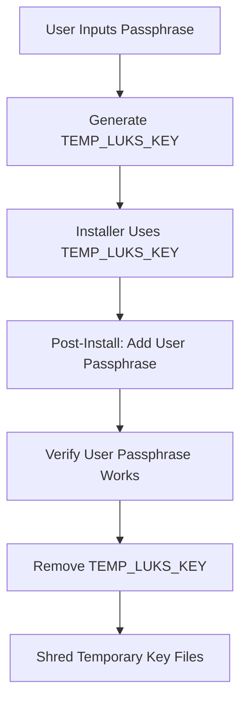
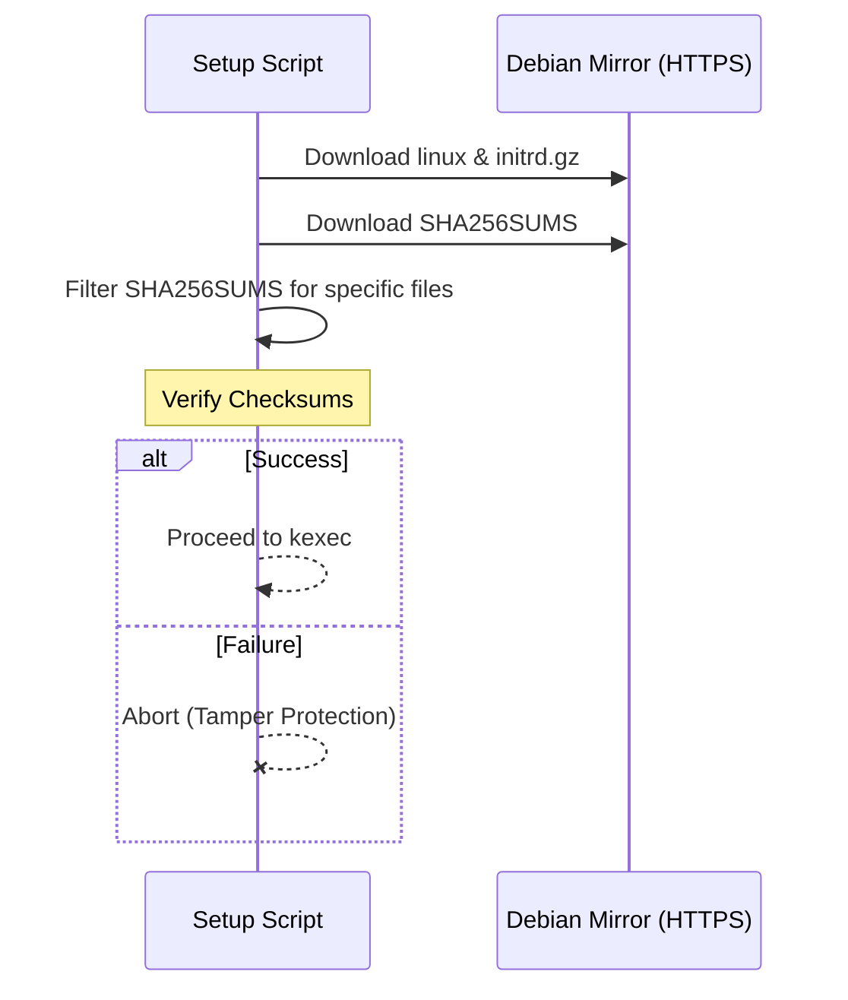

Relevant source files

The following files were used as context for generating this wiki page:

- [README.md](README.md)
- [setup.sh](setup.sh)
- [lib/generate_postinst.sh](lib/generate_postinst.sh)
- [lib/download.sh](lib/download.sh)
- [lib/kexec_boot.sh](lib/kexec_boot.sh)
- [lib/generate_preseed.sh](lib/generate_preseed.sh)

# Security Baseline & Auditing

The **Security Baseline & Auditing** system in the `vps-setup` project provides a comprehensive hardening framework for automated Debian reinstalls. It focuses on establishing a "secure by default" state through full-disk encryption, network isolation, service hardening, and continuous auditing. The system ensures that from the moment of first boot, the VPS adheres to a strict security profile that includes limited authentication vectors, automated patching, and immutable configuration backups.

This framework covers the entire lifecycle of the installation—from the secure download of installation artifacts to the post-installation rotation of secrets and the establishment of an immutable security baseline.

Sources: [README.md:1-26](README.md#L1-L26), [setup.sh:3-16](setup.sh#L3-L16)

## Full-Disk Encryption (LUKS) Lifecycle

The project implements LUKS2 full-disk encryption with a managed key lifecycle designed to eliminate permanent installer keys. The process uses a temporary key for the unattended installation phase, which is later replaced by a user-defined passphrase during the post-installation phase.

### Key Rotation Mechanism
1.  **Generation**: `setup.sh` prompts for a user passphrase and generates a random `TEMP_LUKS_KEY`.
2.  **Provisioning**: The `TEMP_LUKS_KEY` is used by the Debian installer to format the partitions.
3.  **Rotation**: In `postinst.sh`, the user's real passphrase is added to a LUKS keyslot via `cryptsetup luksAddKey`.
4.  **Purging**: The `TEMP_LUKS_KEY` is removed using `cryptsetup luksRemoveKey`, and the temporary file is shredded.

Sources: [README.md:144-154](README.md#L144-L154), [lib/generate_preseed.sh:40-42](lib/generate_preseed.sh#L40-L42), [lib/generate_postinst.sh:58-60](lib/generate_postinst.sh#L58-L60)

The diagram shows the transition from a temporary installation key to the final user-controlled passphrase, ensuring no persistent installer secrets remain on the system.
Sources: [README.md:144-154](README.md#L144-L154), [setup.sh:255-291](setup.sh#L255-L291)

## Network & Access Hardening

The security baseline enforces strict network access controls and SSH daemon hardening. It moves SSH away from the default port and disables password-based authentication entirely.

### SSH & Firewall Configuration
-  **Dropbear Initramfs**: A restricted Dropbear SSH instance runs on port 22 solely for remote LUKS unlocking. It is disabled in the main OS.
-  **OpenSSH Hardening**: The main daemon runs on a custom `SSH_PORT` (default 2222), allows only key-based authentication, and disables root login.
-  **Firewall & Fail2ban**: UFW is configured with a "default deny" policy for incoming traffic. Fail2ban is pre-configured with active jails for the SSH service.

Sources: [README.md:183-195](README.md#L183-L195), [setup.sh:204-220](setup.sh#L204-L220), [lib/generate_postinst.sh:36-40](lib/generate_postinst.sh#L36-L40)

| Feature | Configuration Setting | Impact |
| :--- | :--- | :--- |
| SSH Port | `SSH_PORT` (e.g., 2222) | Obscures SSH service from common bots |
| Root Login | Disabled (Main OS) | Forces use of non-root user via sudo |
| Auth Method | SSH Key Only | Eliminates password brute-force risks |
| LUKS Unlock | Dropbear (Port 22) | Enables remote headless boot with encryption |
| Firewall | UFW (Default Deny) | Minimizes attack surface |

Sources: [README.md:104-123](README.md#L104-L123), [setup.sh:332-340](setup.sh#L332-L340)

## Artifact Integrity & Verification

To prevent "on-path" artifact substitution attacks, the system implements a strict verification pipeline for the Debian netboot files.

### Download Verification Flow
The `download.sh` script enforces HTTPS-only connections and performs SHA256 checksum verification. It downloads the kernel (`linux`) and initial RAM disk (`initrd.gz`), then verifies them against the official `SHA256SUMS` metadata.

The sequence ensures that the kernel being loaded via `kexec` is authentic and untampered, protecting the system from unauthorized code execution during the boot phase.
Sources: [lib/download.sh:65-115](lib/download.sh#L65-L115)

## System Hardening & Auditing Baseline

Once the OS is installed, the system applies several kernel-level and filesystem-level hardening measures.

### Hardening Components
-  **Kernel Restrictions**: Custom `sysctl` rules are applied to restrict network stack vulnerabilities and kernel info leaks.
-  **Filesystem Security**: The `/tmp` and `/dev/shm` directories are mounted with `nodev`, `nosuid`, and `noexec` flags to prevent execution of malicious binaries in world-writable locations.
-  **Audit Logging**: The `auditd` daemon is installed and configured to monitor sensitive system calls and file access.
-  **Security Baseline Backup**: An immutable backup of all security-related configuration files is created in `/root/security-baseline/` for future comparison and auditing.

Sources: [README.md:200-210](README.md#L200-L210), [setup.sh:10-14](setup.sh#L10-L14), [lib/generate_postinst.sh:58-85](lib/generate_postinst.sh#L58-L85)

### Automated Reporting
Upon successful setup, the system generates three primary audit reports in the `/root` directory:
1.  **Installation Summary**: `/root/vps-install-summary.txt`
2.  **Encryption Report**: `/root/encryption-report.txt` (Details LUKS status)
3.  **LUKS Header Backup**: `/root/luks-header-backup.img` (Mode 600, intended for off-site storage)

Sources: [README.md:158-166](README.md#L158-L166)

## Conclusion
The Security Baseline & Auditing module ensures the VPS is deployed with a robust security posture. By combining verified artifact delivery via `download.sh`, strict LUKS key rotation in `generate_postinst.sh`, and the application of production-grade system hardening during the automated install, the project provides a reliable foundation for secure cloud computing. The presence of audit reports and baseline backups further facilitates long-term security maintenance and compliance verification.

Sources: [README.md:131-136](README.md#L131-L136), [setup.sh:386-395](setup.sh#L386-L395)
