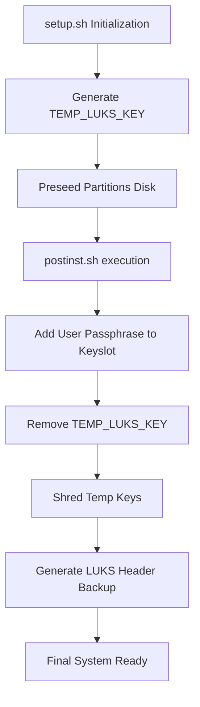
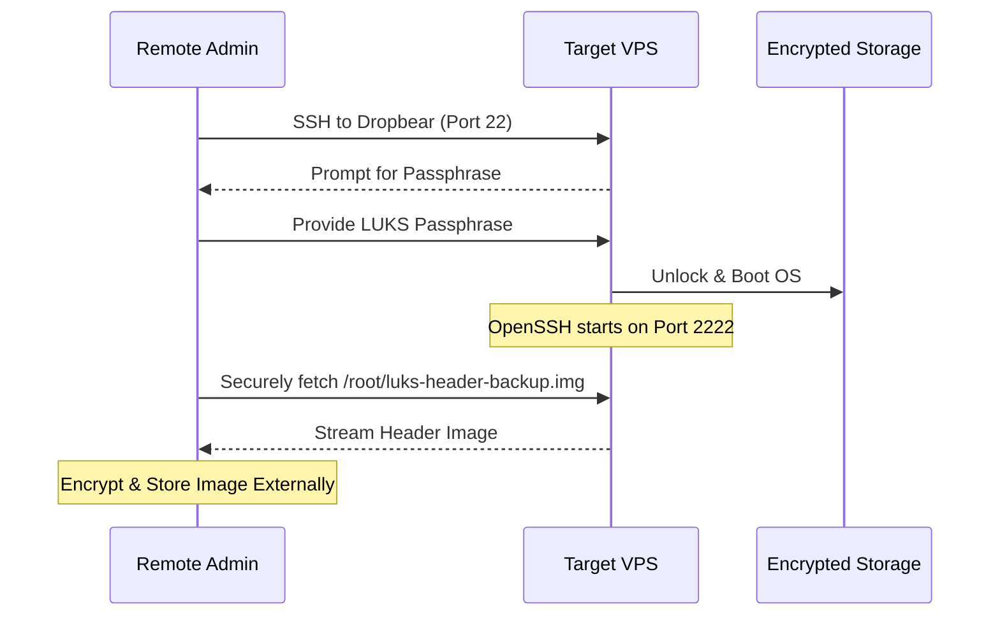

<details>
<summary>Relevant source files</summary>

The following files were used as context for generating this wiki page:

- [README.md](README.md)
- [setup.sh](setup.sh)
- [lib/generate_postinst.sh](lib/generate_postinst.sh)
- [lib/generate_preseed.sh](lib/generate_preseed.sh)
- [lib/kexec_boot.sh](lib/kexec_boot.sh)

</details>

# LUKS Header Backup & Recovery

The LUKS Header Backup & Recovery system within the `vps-setup` project is a critical security and disaster recovery feature. Its primary purpose is to ensure that users can recover access to their encrypted data in the event of LUKS header corruption. Since the project utilizes LUKS2 full-disk encryption for the root partition, the loss of the header would result in permanent data loss, as the encryption keys reside within that header.

The system automates the creation of a header backup during the post-installation phase and provides a standardized path for off-site storage. This mechanism is part of a broader security workflow that includes temporary installer key rotation, SSH-based remote unlocking via Dropbear, and comprehensive server hardening.

Sources: [README.md:16-18](README.md#L16-L18), [README.md:126-129](README.md#L126-L129), [setup.sh:13-16](setup.sh#L13-L16)

## Architecture and Data Flow

The LUKS header management follows a specific lifecycle starting from the initial automated partitioning to the final persistent configuration. The process involves three distinct keys: a temporary random key for the installer, the user's permanent passphrase, and the generated header backup image.

### LUKS Lifecycle Flow
The following diagram illustrates the transition from temporary installation keys to the final secured state including the header backup.



The workflow ensures that no permanent installer keys remain on the system, and the user is left with a recovery image located at a configurable path.

Sources: [README.md:131-137](README.md#L131-L137), [lib/generate_preseed.sh:28-29](lib/generate_preseed.sh#L28-L29), [lib/generate_postinst.sh:37-45](lib/generate_postinst.sh#L37-L45)

## Backup Implementation Details

The backup is generated during the execution of the `postinst.sh` script, which is templated by the `lib/generate_postinst.sh` library. The backup is stored as a raw image file, defaulting to `/root/luks-header-backup.img` with restricted permissions (mode 600).

### Key Components

| Component | Description | Default Value / Path |
|-----------|-------------|----------------------|
| **Backup Path** | The filesystem location where the LUKS header image is stored. | `/root/luks-header-backup.img` |
| **Permissions** | The filesystem mode applied to the backup file to prevent unauthorized access. | `600` (Owner Read/Write) |
| **Tooling** | The utility used to manage keys and potentially perform backups. | `cryptsetup` |
| **Transport** | Recommended method for moving the backup off-site. | `ssh` / `cat` redirection |

Sources: [README.md:137](README.md#L137), [README.md:149-151](README.md#L149-L151), [lib/generate_postinst.sh:53](lib/generate_postinst.sh#L53)

### Template Configuration
The `lib/generate_postinst.sh` file handles the substitution of the `__LUKS_HEADER_BACKUP_PATH__` placeholder, ensuring the post-install script knows exactly where to write the header data based on `config.env` or system defaults.

```bash
local header_backup_path="${LUKS_HEADER_BACKUP_PATH:-/root/luks-header-backup.img}"

# ... substitution in generate_postinst() ...
-e "s|__LUKS_HEADER_BACKUP_PATH__|$(sed_escape "${header_backup_path}")|g"
```

Sources: [lib/generate_postinst.sh:53](lib/generate_postinst.sh#L53), [lib/generate_postinst.sh:80](lib/generate_postinst.sh#L80)

## Recovery and Off-site Storage

The project documentation emphasizes that the header backup is only useful if moved off-site. The documentation provides a specific command pattern for retrieving the backup securely after the first boot.

### Off-site Retrieval Process
The sequence below shows how a user interacts with the system post-installation to secure the recovery image.



Sources: [README.md:104-108](README.md#L104-L108), [README.md:149-151](README.md#L149-L151), [lib/kexec_boot.sh:103-108](lib/kexec_boot.sh#L103-L108)

### Retrieval Command
Users are instructed to use the following command to retrieve the backup while maintaining strict local permissions:

```bash
umask 077 && ssh -p 2222 yourname@YOUR_VPS_IP 'sudo cat /root/luks-header-backup.img' > ./luks-header-backup.img
```

Sources: [README.md:151](README.md#L151)

## Security Considerations

The LUKS Header Backup is sensitive data. While the project automates its creation, it imposes several security constraints:
1.  **Sanitization:** The `postinst.sh` script is responsible for sanitizing logs (`/var/log/vps-postinst.log` and `syslog`) to ensure no key material or sensitive metadata related to the header creation process remains visible.
2.  **Key Rotation:** The backup is only generated after the `TEMP_LUKS_KEY` (a 32-byte random hex string generated via `openssl rand`) has been replaced by the user's real passphrase and shredded.
3.  **Local Isolation:** The backup file is owned by root and set to mode 600 to prevent local non-privileged users from accessing the header.

Sources: [README.md:131-137](README.md#L131-L137), [lib/generate_preseed.sh:28-29](lib/generate_preseed.sh#L28-L29), [lib/generate_postinst.sh:37-45](lib/generate_postinst.sh#L37-L45)

## Summary
The LUKS Header Backup & Recovery module provides a necessary safety net for full-disk encrypted VPS deployments. By integrating the creation of `/root/luks-header-backup.img` into the automated post-installation workflow, the project ensures that disaster recovery assets are created immediately upon system readiness. Users are ultimately responsible for moving this image to external, encrypted storage to protect against physical or logical drive failure.
