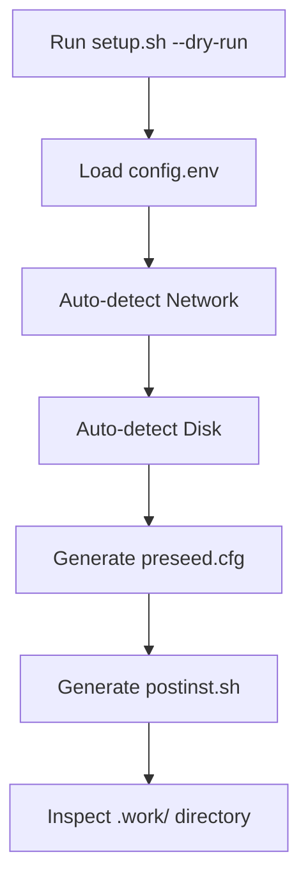
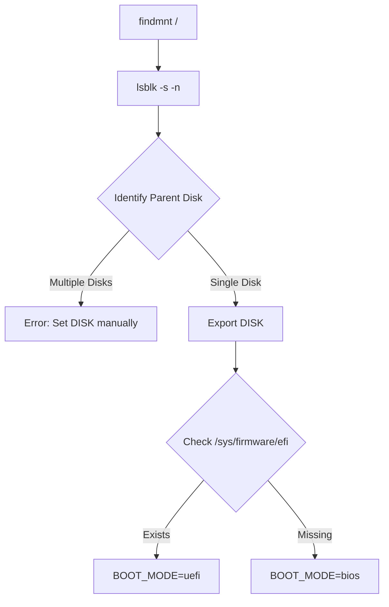

Relevant source files

The following files were used as context for generating this wiki page:

- [README.md](README.md)
- [setup.sh](setup.sh)
- [lib/detect_network.sh](lib/detect_network.sh)
- [lib/detect_disk.sh](lib/detect_disk.sh)
- [lib/download.sh](lib/download.sh)
- [lib/kexec_boot.sh](lib/kexec_boot.sh)

# Testing & Validation Checklist

The Testing & Validation Checklist provides a structured framework for verifying the automated Debian reinstallation process. It ensures that the system correctly handles pre-flight requirements, network and disk auto-detection, LUKS encryption integrity, and post-installation security hardening. This checklist is critical for ensuring the reliability of the automation before deploying it to production environments.

The validation process spans from local environment checks to the "Point of No Return" where `kexec` replaces the running kernel. It includes specific verification suites for single-disk installs, storage-vps roles, and remote unlock accessibility.
Sources: [README.md:144-147](README.md#L144-L147), [setup.sh:370-385](setup.sh#L370-L385)

## Pre-flight & Environment Validation

Before any installation steps occur, the system performs a suite of pre-flight checks to validate the host environment's compatibility. This includes checking user privileges, operating system type, CPU architecture, and virtualization technology.

### Environment Requirements
The following table summarizes the mandatory environment states verified during the pre-flight phase:

| Check | Requirement | File Reference |
| :--- | :--- | :--- |
| **User Privileges** | Must be `root` (EUID 0) | `setup.sh:66-69` |
| **OS Type** | Must be `Linux` | `setup.sh:72-75` |
| **Architecture** | Optimized for `x86_64` | `setup.sh:78-83` |
| **Virtualization** | KVM, Xen, VMware (Not LXC/OpenVZ) | `setup.sh:86-100` |
| **Commands** | `ip`, `wget`, `python3`, `kexec`, `lsblk` | `setup.sh:103-111` |

Sources: [setup.sh:64-111](setup.sh#L64-L111)

## Dry Run & Configuration Validation

The "Dry Run" mode (`--dry-run` or `-n`) allows for the generation and inspection of all configuration files without modifying the host system. This is a primary validation step to ensure that templates are populated correctly with values from `config.env`.

The flow shows how the dry run executes all logic up until file generation, stopping before downloading or booting.
Sources: [setup.sh:195-207](setup.sh#L195-L207), [setup.sh:357-368](setup.sh#L357-L368)

### Configuration Verification
Users must verify the following generated files in the `.work/` directory during a dry run:
*  **preseed.cfg**: Contains the Debian installer configuration, including partitioning recipes and network settings.
*  **postinst.sh**: The post-installation script containing system hardening logic.
Sources: [README.md:113-122](README.md#L113-L122), [setup.sh:267-279](setup.sh#L267-L279)

## Automated Detection Validation

The system relies on auto-detection for networking and storage. Validating these results against the actual hardware/VPS environment is essential.

### Network Configuration Validation
The script detects the primary interface and associated IP parameters. Validation is performed by the `detect_network` function.
Sources: [lib/detect_network.sh:13-16](lib/detect_network.sh#L13-L16)

| Parameter | Detection Logic | Source |
| :--- | :--- | :--- |
| **Interface** | Checks default route via `ip -o route` | [lib/detect_network.sh:22-26](lib/detect_network.sh#L22-L26) |
| **IPv4/CIDR** | Parsed from `ip -o -4 addr show` | [lib/detect_network.sh:30-38](lib/detect_network.sh#L30-L38) |
| **Gateway** | Parsed from `ip -4 route show default` | [lib/detect_network.sh:41](lib/detect_network.sh#L41) |
| **DNS** | Parsed from `/etc/resolv.conf` | [lib/detect_network.sh:58-62](lib/detect_network.sh#L58-L62) |

### Disk & Boot Mode Detection
The `detect_disk` logic traces the root filesystem (`/`) to its physical parent device to ensure the correct OS disk is targeted.
Sources: [lib/detect_disk.sh:13-14](lib/detect_disk.sh#L13-L14)

This diagram illustrates the logic used to safely identify the target installation disk and determine if the system requires a UEFI or BIOS partitioning scheme.
Sources: [lib/detect_disk.sh:35-59](lib/detect_disk.sh#L35-L59), [lib/detect_disk.sh:147-154](lib/detect_disk.sh#L147-L154)

## Security & LUKS Integrity Validation

Validation of the LUKS setup involves verifying the temporary-to-permanent key rotation and the remote unlock mechanism.

1.  **Temporary Key Security**: The `setup.sh` generates a `TEMP_LUKS_KEY` used only for the initial automated partition. This key is shredded after the real user passphrase is added during post-installation.
  Sources: [README.md:131-135](README.md#L131-L135), [lib/generate_preseed.sh:29-30](lib/generate_preseed.sh#L29-L30)
2.  **Remote Unlock Test**: After installation, users must verify that they can connect to port 22 (Dropbear) and that the `cryptroot-unlock` prompt correctly accepts the passphrase.
  Sources: [README.md:154-157](README.md#L154-L157)
3.  **Key Rotation Verification**: The `postinst.sh` (derived from `postinst.sh.tmpl`) is responsible for adding the permanent key and removing the temporary one.
  Sources: [README.md:131-137](README.md#L131-L137)

## Installation Role Validation

The system supports two distinct roles that require different validation approaches:

### 1. Standard Role (`standard`)
*  **Check**: Verify that only the primary OS disk is targeted.
*  **Verification**: All secondary disks must remain untouched and unmounted.
Sources: [README.md:80-84](README.md#L80-L84), [lib/detect_disk.sh:111-114](lib/detect_disk.sh#L111-L114)

### 2. Storage VPS Role (`storage-vps`)
*  **Check**: Verify the interactive scanning of additional disks.
*  **Verification**: Script must prompt for each disk: (1) Leave untouched, (2) Format/Mount, or (3) Manual.
Sources: [README.md:86-94](README.md#L86-L94), [lib/detect_disk.sh:117-124](lib/detect_disk.sh#L117-L124)

## Post-Installation Checklist

Following a successful `kexec` jump and installation, the following verification suite must be performed:

| Task | Description | Source |
| :--- | :--- | :--- |
| **LUKS Unlock** | SSH to port 22; verify passphrase unlocks volume. | [README.md:154-157](README.md#L154-L157) |
| **Main SSH** | Verify OpenSSH is active on `SSH_PORT` (default 2222). | [README.md:159-161](README.md#L159-L161) |
| **Reports** | Inspect `/root/vps-install-summary.txt` and `encryption-report.txt`. | [README.md:144-148](README.md#L144-L148) |
| **Header Backup** | Securely retrieve `/root/luks-header-backup.img`. | [README.md:149-151](README.md#L149-L151) |
| **Service Audit** | Verify `dropbear` is inactive in the main OS. | [README.md:158-160](README.md#L158-L160) |

Sources: [README.md:142-162](README.md#L142-L162)

## Summary
The Testing & Validation Checklist ensures the automated deployment pipeline is secure and technically sound. By utilizing the `--dry-run` feature and following the post-installation verification steps, administrators can guarantee that LUKS encryption, network auto-detection, and system hardening are applied correctly according to the project's architecture.
Sources: [README.md:108-112](README.md#L108-L112), [setup.sh:17-25](setup.sh#L17-L25)
