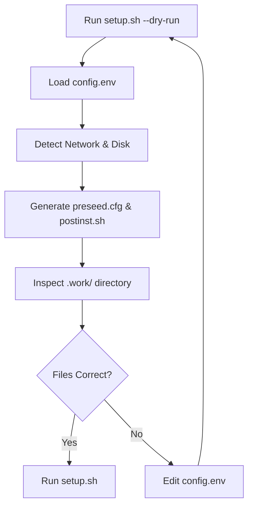
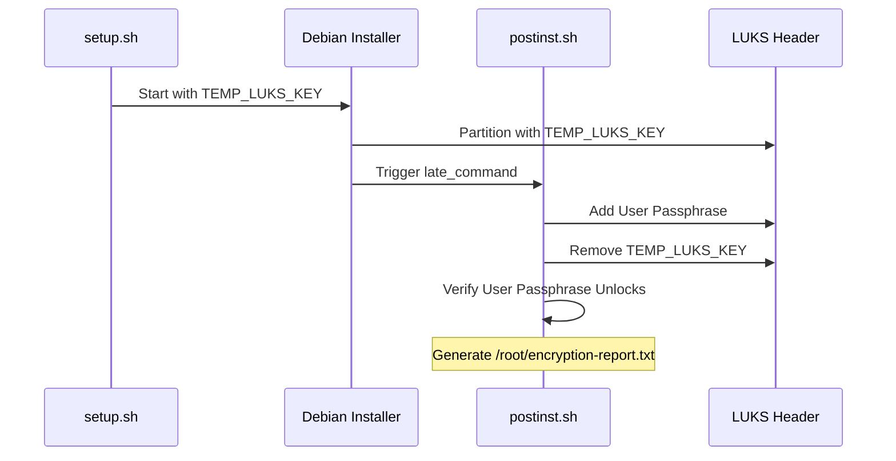

Relevant source files

The following files were used as context for generating this wiki page:

- [README.md](README.md)
- [setup.sh](setup.sh)
- [lib/detect_network.sh](lib/detect_network.sh)
- [lib/kexec_boot.sh](lib/kexec_boot.sh)
- [lib/download.sh](lib/download.sh)
- [lib/generate_postinst.sh](lib/generate_postinst.sh)

# Troubleshooting & Logs

This page provides a comprehensive guide to diagnosing issues and reviewing logs generated during the automated Debian reinstallation process. The system employs several layers of logging—from initial pre-flight checks and network auto-detection to post-installation hardening reports—to ensure that administrators can verify the integrity of the LUKS encryption and server hardening.

Understanding the log locations and the troubleshooting tools available is critical because the installation involves a `kexec` jump, which replaces the running kernel and terminates the current SSH session.

## Pre-Installation Diagnosis

Before the `kexec` execution, the script performs several validation steps. Failures at this stage are logged directly to the standard output of the terminal where `setup.sh` is executed.

### Pre-flight and Configuration Validation
The system checks for root access, Linux compatibility, architecture (x86_64), and virtualization type. It specifically verifies that the environment is not a container (LXC/OpenVZ), as `kexec` requires full virtualization (KVM/Xen/VMware).
Sources: [setup.sh:86-118](setup.sh#L86-L118)

### Dry Run Mode
Administrators can use the `--dry-run` or `-n` flag to troubleshoot configuration issues without modifying the system. This mode generates all necessary files in the `.work/` directory for manual inspection.
Sources: [setup.sh:379-389](setup.sh#L379-L389), [README.md:92-100](README.md#L92-L100)

This diagram shows the recommended troubleshooting workflow using the Dry Run feature to validate configuration before execution.

## Installation Phase Logs

During the active installation, the Debian installer fetches configuration from a temporary HTTP server.

### Netboot Download Verification
The `lib/download.sh` script verifies the integrity of the downloaded Debian kernel (`linux`) and initial RAM disk (`initrd.gz`) using SHA256 checksums fetched from the mirror. If checksum verification fails, a warning is issued to the console.
Sources: [lib/download.sh:58-69](lib/download.sh#L58-L69)

### Network and HTTP Server Logs
If the Debian installer cannot reach the preseed file, the issue usually lies in the temporary Python HTTP server or network parameters.
*  **Port Check**: The script checks if the `PRESEED_PORT` (default 8080) is already in use via `fuser`.
*  **Connectivity**: The installer requires static IP parameters passed via kernel cmdline to reach the host.
Sources: [lib/kexec_boot.sh:18-35](lib/kexec_boot.sh#L18-L35), [lib/kexec_boot.sh:82-95](lib/kexec_boot.sh#L82-L95)

| Component | Log/Output Location | Purpose |
| :--- | :--- | :--- |
| **HTTP Server** | Console Output | Verifies if `python3 -m http.server` started successfully. |
| **kexec Load** | Console Output | Confirms the kernel and initrd were loaded into memory. |
| **Network Config** | `print_network_config` | Displays detected/configured IPv4, Gateway, and DNS. |

Sources: [lib/kexec_boot.sh:40-45](lib/kexec_boot.sh#L40-L45), [lib/detect_network.sh:135-157](lib/detect_network.sh#L135-L157)

## Post-Installation & Security Reports

Once the installation is complete and the system is booted, several logs and summary files are created in the `/root` directory of the new system to verify successful execution of the hardening steps.

### Verification Files
The `postinst.sh` script generates several reports for the administrator to review upon first login:

1.  **Installation Summary**: Located at `/root/vps-install-summary.txt`.
2.  **Encryption Report**: Located at `/root/encryption-report.txt`, which details the LUKS status and key rotation success.
3.  **Security Baseline**: A directory at `/root/security-baseline/` containing immutable backups of security configurations.
4.  **Post-Install Log**: A detailed log of the hardening process at `/var/log/vps-postinst.log`.

Sources: [README.md:144-149](README.md#L144-L149), [README.md:203-207](README.md#L203-L207)

### LUKS Key Rotation Troubleshooting
The script uses a temporary key for installation which is later replaced by the user's passphrase.
*  **Failure Scenario**: If `cryptsetup luksAddKey` fails or if the temporary key isn't removed correctly, the script is designed to sanitize logs to prevent secret leakage.
*  **Recovery**: An unencrypted LUKS header backup is created at `/root/luks-header-backup.img` (mode 600) to assist in disaster recovery.
Sources: [README.md:183-193](README.md#L183-L193)

The sequence above illustrates the critical transition from the temporary installation key to the user's permanent passphrase, a common point for troubleshooting disk access.

## Common Issues and Resolutions

| Issue | Potential Cause | Resolution |
| :--- | :--- | :--- |
| **kexec fails to execute** | Container virtualization (OpenVZ/LXC) | Ensure VPS uses KVM or Bare-Metal. |
| **SSH timeout after kexec** | Incorrect network parameters in `config.env` | Use VNC/IPMI console to check installer network status. |
| **Dropbear not prompting** | Initramfs network driver missing or config error | Check `__INITRAMFS_IP__` in `lib/generate_postinst.sh`. |
| **LUKS Unlock fails** | Keyboard layout mismatch or typo during setup | Use LUKS header backup to recover if passphrase is lost. |

Sources: [setup.sh:105-115](setup.sh#L105-L115), [lib/generate_postinst.sh:33-35](lib/generate_postinst.sh#L33-L35), [README.md:129-137](README.md#L129-L137)

## Conclusion
Troubleshooting the `vps-setup` process relies on a combination of pre-installation "Dry Runs" and post-installation report verification. Because the `kexec` process is destructive and replaces the operating system in memory, administrators should always verify the network and disk auto-detection output provided in the `Installation Summary` block before typing `YES` to proceed.
Sources: [setup.sh:226-253](setup.sh#L226-L253), [setup.sh:425-450](setup.sh#L425-L450)
